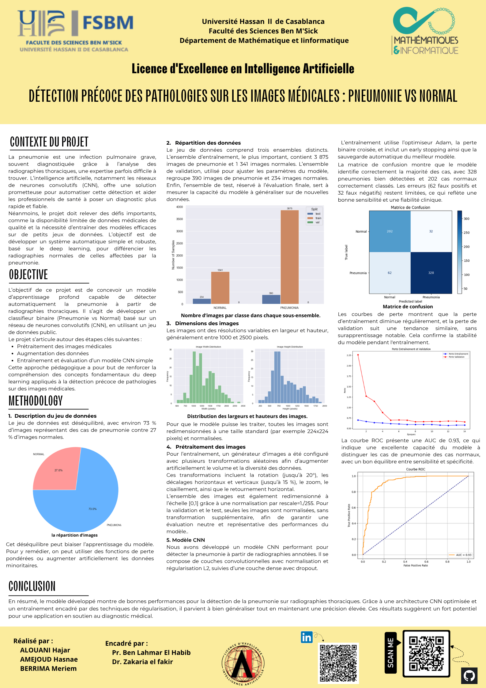

# DeepLearning

## Détection précoce des pathologies sur les images médicales : Pneumonie vs Normal

This project focuses on the early detection of pneumonia from chest X-ray images using a Convolutional Neural Network (CNN). The model is trained and validated on a public dataset of chest radiographs and is deployed via a Flask API with a user-friendly Streamlit interface for image upload and prediction.

---

## Project Poster

---

## Features

- Binary classification of chest X-ray images into Normal or Pneumonia
- Data preprocessing with image resizing, normalization, and augmentation
- CNN architecture with convolutional, dropout, and dense layers
- Use of regularization techniques and early stopping to prevent overfitting
- Evaluation using confusion matrix, loss curves, and ROC AUC metric
- Deployment via Flask REST API
- Streamlit web application for easy interaction and visualization

---

## Dataset

The dataset used is a public chest X-ray dataset containing both pneumonia and normal cases. It is imbalanced, with approximately 73% pneumonia cases and 27% normal. Images were resized to 224x224 pixels and augmented during training.

---

## Installation and Setup

### Prerequisites

- Python 3.7+
- TensorFlow
- Flask
- Streamlit

### Steps

1. Clone this repository:

   ```bash
   git clone https://github.com/HajarAlouani/DeepLearning.git
   
